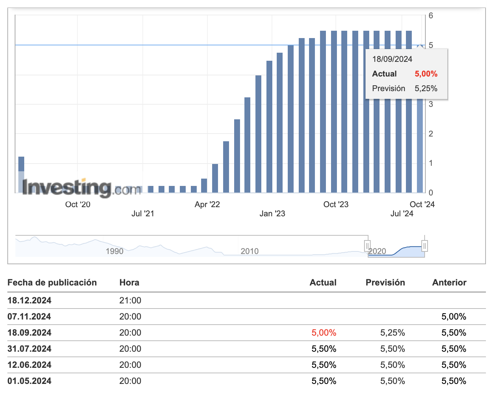
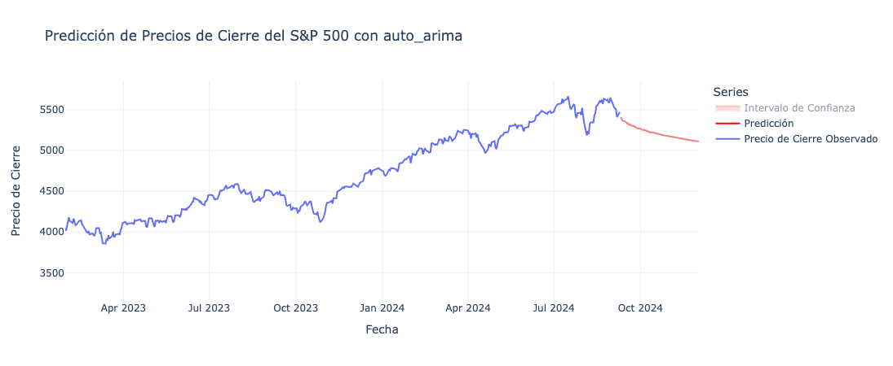
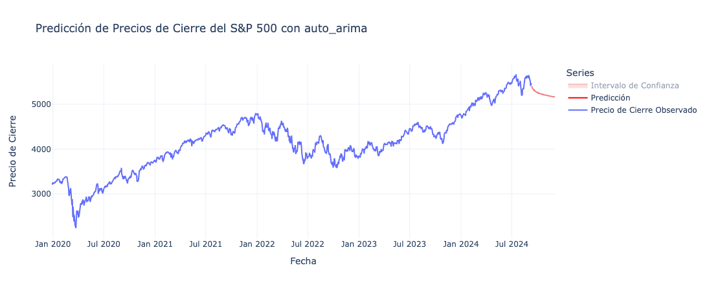
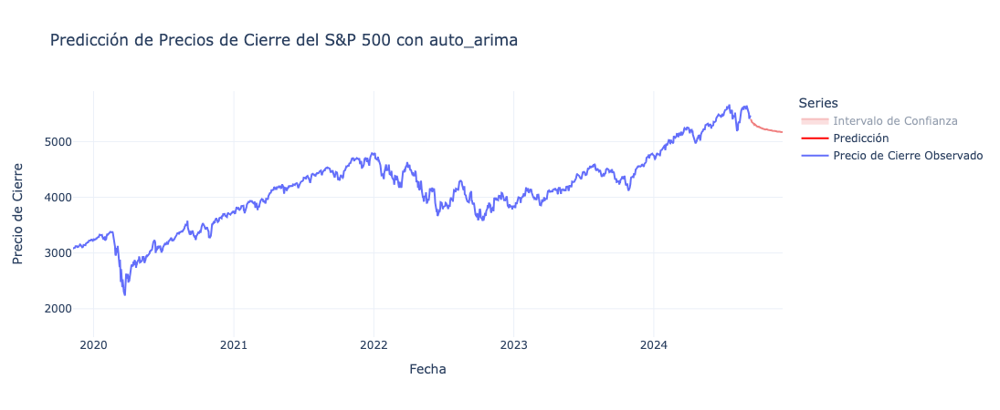

Aquí tienes el README completo con emojis para resaltar algunos puntos clave:

---

# 📊 Análisis de Series Temporales del S&P 500 📉

Este proyecto realiza un análisis de series temporales del índice **S&P 500**, utilizando modelos **ARIMA** para predecir su comportamiento a 60 días.

## 📄 Descripción

El **S&P 500** es uno de los índices más longevos y fuertes, pero actualmente se enfrenta a una situación complicada debido a los tipos de interés en EE. UU., que inicialmente estaban al 5.5% y han disminuido al 5%, lo que representa una mejora. Sin embargo, la previsión indica que el precio buscará el soporte más cercano, que se sitúa en los **5408 $**, según el pronóstico del modelo.

## 📈 Gráfico de Tipos de Interés

A continuación se muestra un gráfico que ilustra la tendencia de los tipos de interés en EE. UU.:



## 🛠️ Modelos Utilizados

Se han comparado tres modelos ARIMA para el pronóstico:

1. **ARIMA(9,1,8)**: Este modelo surgió como el de mejor desempeño con un **AIC de 35756.067**, equilibrando la complejidad y el poder predictivo de manera efectiva.
   

2. **ARIMA(10,1,10)**: Con un **AIC de 35770.361**, este modelo proporcionó información sólida pero agregó una complejidad innecesaria.
   

3. **ARIMA(8,1,9)**: Aunque competitivo con un **AIC de 35761.947**, no superó a la combinación 9-8.
   

## 🔍 Principales Hallazgos

- **ARIMA(9,1,8)** no solo minimizó el AIC, sino que también demostró solidez a la hora de capturar los patrones subyacentes en los datos 📊.
- Las métricas de rendimiento indican que, si bien la complejidad puede ofrecer un ajuste más preciso, no siempre se traduce en mejores capacidades predictivas.

## 🚀 Conclusión Mejorada

El modelo **ARIMA(9,1,8)** se destacó como la mejor opción para pronosticar el comportamiento del **S&P 500** en este análisis, especialmente al minimizar el **AIC** y capturar los patrones subyacentes de los datos. A pesar de la reciente reducción de los tipos de interés en EE. UU. del 5.5% al 5%, el mercado aún podría buscar el soporte en **5408 $**, como indica el pronóstico 📉.

No obstante, **ARIMA** presenta ciertas limitaciones, especialmente en un entorno de mercado tan complejo como el **S&P 500**. Los cambios rápidos en el mercado financiero, así como la baja autocorrelación en los datos, pueden ser difíciles de capturar únicamente con modelos ARIMA. Por ello, proponemos explorar otras alternativas y combinaciones de enfoques que podrían mejorar las predicciones:

### 🔧 1. Modelos de Machine Learning Avanzados

- **Redes Neuronales Recurrentes (RNN) y LSTM**: Estos modelos son excelentes para trabajar con series temporales y podrían capturar patrones más complejos y no lineales que ARIMA no puede detectar. Las **LSTM** son particularmente efectivas para manejar secuencias largas y detectar dependencias a largo plazo en los datos 🔄.

### 🔗 2. Modelos Híbridos

- Una combinación de **ARIMA** con redes neuronales podría ofrecer una solución robusta. El enfoque híbrido (**ARIMA + LSTM**, por ejemplo) permitiría capturar tanto los componentes lineales como los no lineales de los datos.
- **SARIMA** o **ARIMAX**: Estos modelos permiten incorporar variables exógenas (como los tipos de interés o los volúmenes de negociación 📊) que podrían mejorar la precisión del pronóstico, integrando el impacto directo de las políticas económicas en las predicciones.

### ⏳ 3. Tecnologías de Procesamiento en Tiempo Real

- Usar tecnologías como **Apache Kafka** o **Amazon Kinesis** podría permitir la recolección y análisis de datos en tiempo real, lo que mejoraría la capacidad de respuesta del modelo ante los cambios repentinos en el mercado 🚀.
- Implementar modelos en la nube utilizando **API financieras** para integrar datos en tiempo real y mejorar la capacidad de predicción mediante actualizaciones continuas 🌐.

En resumen, aunque **ARIMA(9,1,8)** es una opción sólida para este análisis, existen oportunidades significativas para mejorar el pronóstico al integrar otras tecnologías y enfoques más sofisticados. Estos modelos y tecnologías complementarios permitirían una mayor precisión y flexibilidad, adaptándose mejor a la naturaleza dinámica y no lineal del **S&P 500** 📈.

## 💻 Instalación

```bash
pip install -r requirements.txt
```

---

Este README incluye toda la información clave del proyecto, los modelos utilizados y las conclusiones extraídas, con sugerencias para explorar tecnologías más avanzadas y mejorar las predicciones.
